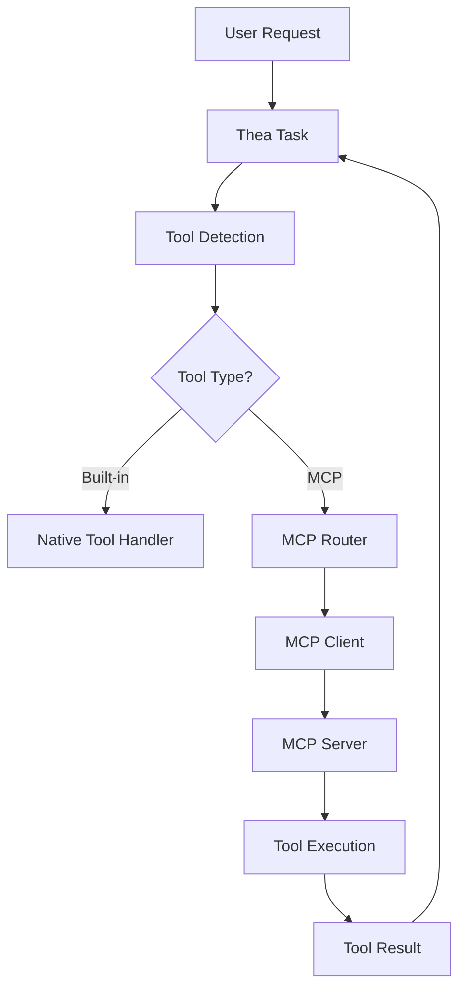
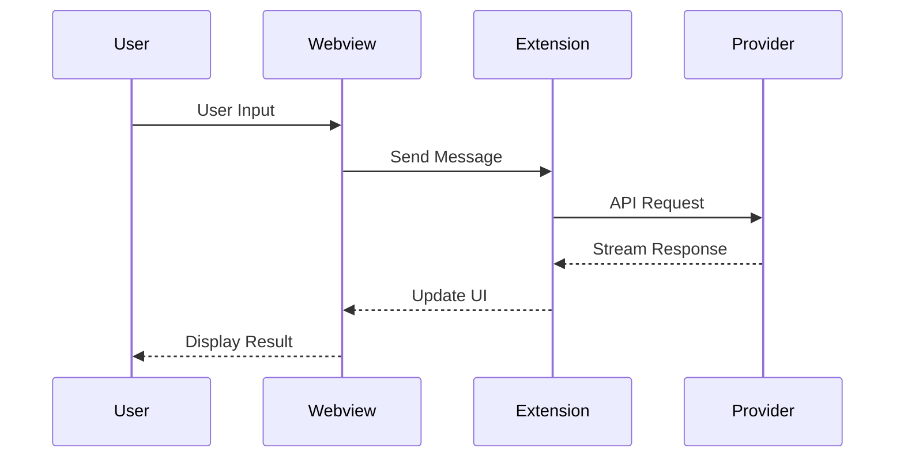

# Thea Code Technical Reference

**Status:** Published  
**Last Updated:** 2025-08-10  
**Category:** Technical Reference

## Overview

This section provides detailed technical reference documentation for Thea Code's advanced features, protocols, and components.

## Reference Categories

### [MCP (Model Context Protocol)](./mcp/README.md)
Comprehensive documentation of the MCP system
- [MCP Overview](./mcp/README.md)
- [Integration Guide](./mcp/integration.md)
- [Protocol Specification](./mcp/protocols.md)
- [Tool Registration](./mcp/tools.md)
- [Transport Layers](./mcp/transport.md)

### [Tool System](./tools/README.md)
Reference for built-in and custom tools
- [Tool Overview](./tools/README.md)
- [Built-in Tools](./tools/built-in.md)
- [Custom Tool Development](./tools/custom.md)
- [Tool Schemas](./tools/schemas.md)
- [Ollama-OpenAI Integration](./tools/ollama-openai.md)

### [UI Components](./ui-components/README.md)
Webview and UI component reference
- [Component Overview](./ui-components/README.md)
- [State Management](./ui-components/state-management.md)
- [Communication Protocols](./ui-components/communication.md)
- [React Components](./ui-components/components.md)
- [Theme System](./ui-components/themes.md)

## Quick Reference

### MCP Tool Format

```typescript
interface McpTool {
  name: string;
  description: string;
  inputSchema: {
    type: "object";
    properties: Record<string, any>;
    required?: string[];
  };
}
```

### Message Protocol

```typescript
interface WebviewMessage {
  type: string;
  payload?: any;
  id?: string;
  timestamp?: number;
}
```

### Provider Interface

```typescript
interface ApiHandler {
  createMessage(params: CreateMessageParams): AsyncGenerator<ApiStreamChunk>;
  getModel(): string;
  getMaxTokens(): number;
}
```

## Architecture Diagrams

### MCP Integration Flow



### Message Flow



## Configuration Reference

### Provider Configuration

```json
{
  "thea.apiProvider": "anthropic",
  "thea.apiKey": "sk-...",
  "thea.apiModel": "claude-3-opus",
  "thea.apiBaseUrl": "https://api.anthropic.com"
}
```

### MCP Server Configuration

```json
{
  "thea.mcpServers": {
    "filesystem": {
      "command": "node",
      "args": ["@modelcontextprotocol/server-filesystem"],
      "env": {
        "ALLOWED_PATHS": "/workspace"
      }
    }
  }
}
```

### Custom Mode Configuration

```json
{
  "thea.customModes": [
    {
      "name": "architect",
      "instructions": "You are a system architect...",
      "tools": ["read-file", "search-files"],
      "temperature": 0.3
    }
  ]
}
```

## API Specifications

### Neutral Message Format

```typescript
interface NeutralMessage {
  role: "user" | "assistant" | "system";
  content: string | ContentBlock[];
  tool_calls?: ToolCall[];
  tool_result?: ToolResult;
}

interface ContentBlock {
  type: "text" | "image" | "tool_use" | "tool_result";
  text?: string;
  image?: ImageBlock;
  tool_use?: ToolUseBlock;
  tool_result?: ToolResultBlock;
}
```

### Stream Chunk Types

```typescript
type ApiStreamChunk = 
  | ApiStreamTextChunk
  | ApiStreamToolUseChunk
  | ApiStreamToolResultChunk
  | ApiStreamUsageChunk
  | ApiStreamReasoningChunk;

interface ApiStreamTextChunk {
  type: "text";
  content: string;
}

interface ApiStreamToolUseChunk {
  type: "tool_use";
  tool: ToolUse;
}
```

## Performance Specifications

### Response Time Targets

| Operation | Target | Maximum |
|-----------|--------|---------|
| Tool Registration | <100ms | 500ms |
| Message Routing | <50ms | 200ms |
| Stream Start | <1s | 3s |
| Tool Execution | <5s | 30s |

### Memory Limits

| Component | Limit | Notes |
|-----------|-------|-------|
| Context Window | Model-dependent | 8k-200k tokens |
| File Cache | 100MB | Per workspace |
| History | 50 tasks | Configurable |
| Tool Results | 10MB | Per execution |

## Security Considerations

### API Key Storage
- Stored in VSCode SecretStorage
- Never logged or transmitted in plain text
- Scoped per workspace

### File Access
- Limited to workspace directory
- Respects .gitignore and .theaignore
- No access to system files

### Tool Execution
- Sandboxed environment
- User approval required for destructive operations
- Audit log maintained

## Protocol Specifications

### SSE Transport

```typescript
interface SseMessage {
  event?: string;
  data: string;
  id?: string;
  retry?: number;
}
```

### STDIO Transport

```typescript
interface StdioMessage {
  jsonrpc: "2.0";
  method?: string;
  params?: any;
  result?: any;
  error?: any;
  id?: string | number;
}
```

## Error Codes

| Code | Description | Resolution |
|------|-------------|------------|
| E001 | API key missing | Configure API key in settings |
| E002 | Invalid model | Check supported models |
| E003 | Rate limit exceeded | Wait and retry |
| E004 | Context limit exceeded | Reduce input size |
| E005 | Tool execution failed | Check tool configuration |
| E006 | MCP server unreachable | Verify server is running |

## Telemetry Events

| Event | Description | Data |
|-------|-------------|------|
| task.start | New task initiated | Provider, model |
| task.complete | Task finished | Duration, tokens |
| tool.execute | Tool executed | Tool name, success |
| error.api | API error occurred | Error code, provider |

## Glossary

- **MCP** - Model Context Protocol, standardized tool interface
- **Neutral Format** - Provider-agnostic message format
- **SSE** - Server-Sent Events, streaming protocol
- **STDIO** - Standard Input/Output, process communication
- **Tool** - Executable function available to the AI
- **Provider** - API service (Anthropic, OpenAI, etc.)
- **Mode** - Behavioral configuration for the assistant

## Version Compatibility

| Thea Version | VSCode | Node.js | MCP SDK |
|--------------|--------|---------|---------|
| 1.0.0+ | 1.85.0+ | 18.0+ | 0.1.0+ |

## Related Documentation

- [Developer Guide](../developer-guide/README.md)
- [Architecture Overview](../developer-guide/architecture/README.md)
- [API Reference](../developer-guide/api-reference/README.md)
- [User Guide](../user-guide/README.md)

---

**Need more technical details?** Check the source code or ask in our [Discord #development channel](https://discord.gg/EmberHarmony).